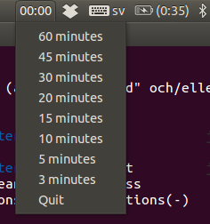

# Ubuntu timer
A small timer application that is always visible in the status-bar. You set the timer by clicking on it an choosing a specified timer. Default timers are in minutes: *60, 45, 30, 20, 15, 10, 5, 3*. The timer always counts down to zero. 

*As seen on the left side in the image above*

*Ubuntu timer with the menu open*

## Requirements
The timer needs the following

* Ubuntu
* Python 2.7
* Python package gtk

## Start
Just make the timer executable `chmod +x timer.py` and run it `./timer.py` to start. 
The timer has a *Quit* item in the menu so that you can run it in its own shell. `./timer.py &`, this way you can continue to use the terminal tab you started the timer with.